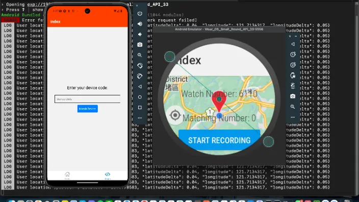

# Cherished-Link: Behavior-Based Early Dementia Detection Machine Learning Model
As the world gradually enters an aging society, dementia shows an exponential growth trend with increasing age. The series of examination processes for diagnosing dementia are quite complex for family members and elderly individuals. Some family members or even the patients themselves may ignore symptoms in the early stages, leading to delayed medical treatment and increased risk of subsequent symptom onset. The main purpose of this research is to explore early dementia identification and notification to users and family members, achieving the goal of early warning and timely medical intervention. This study uses publicly available Chinese speech databases, with research methods mainly divided into data preprocessing, basic machine learning, and location data processing. By converting original speech data from companions into text, extracting features based on early dementia behavioral characteristics such as outdoor behavior, social behavior, indoor behavior, logical semantics, etc., and then using machine learning algorithms to establish dementia warning models, conducting specific location sample comparison and wandering/lost identification based on positioning data, finally establishing a dementia identification system for use by family members and home companions.



## Setup

### Python
* Package installation (recommended to use virtual environment)
    ```shell
    pip install -r /backend/requirements.txt
    ```

### MongoDB
* [Mac brew install](https://www.mongodb.com/zh-cn/docs/manual/tutorial/install-mongodb-on-os-x/)
* start: `brew services start mongodb-community@7.0`
* view: use [Compass](https://www.mongodb.com/products/tools/compass)
* stop: `brew services stop mongodb-community@7.0`

### Expo
* download & install [Android Studio](https://developer.android.com/studio?hl=zh-tw)
    * click "Virtual Device Manager"
    * device: Pixel 8 API 35
    * run device
* install Expo: 
    ```
    npx create-expo-app@latest
    npx expo install expo-notifications expo-location
    ```
* install eas:
    ```shell
    npm install -g eas-cli
    eas init
    ```
* login: `npx expo login`

## Quick Start

### Python Backend
* `cd backend`
* `python App.py`
* The screen will display something like this:
    ```sh
    * Running on all addresses (0.0.0.0)
    * Running on http://127.0.0.1:5000
    * Running on http://192.168.4.114:5000
    ```

### Run watch
* Open a new terminal
* `cd watch`
* `export EXPO_PUBLIC_BACKEND_URL={URL}/watch` 
    * Use the URL from the "third line" shown by the backend above, ex: `export EXPO_PUBLIC_BACKEND_URL=http://192.168.4.114:5000/watch`
    * For Windows, use `$Env:EXPO_PUBLIC_BACKEND_URL = "http://192.168.4.114:5000/watch"`
* `npx expo start`
* press `shift+a`
* select watch

### Run phone
* Open a new terminal
* `cd phone`
* `export EXPO_PUBLIC_BACKEND_URL={URL}/phone` 
    * Use the URL from the "third line" shown by the backend above, ex: `export EXPO_PUBLIC_BACKEND_URL=http://192.168.4.114:5000/phone`
    * For Windows, use `$Env:EXPO_PUBLIC_BACKEND_URL = "http://192.168.4.114:5000/phone"`
* `npx expo start`
* press `shift+a`
* select emulator
